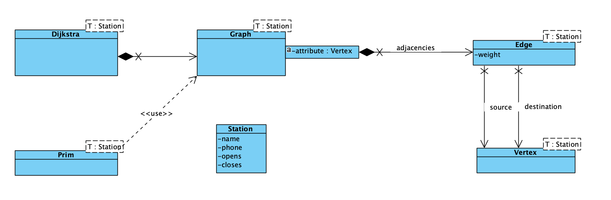

# Graphs Example

This demonstration implements a Graph data structure with C++ and demonstrates the usage of graphs with two projects.

**Note** that this is *work in progress* so there are changes and additions coming and bugs fixed as we go. Check the latest commit dates. If commits are old, probably I'm done.

The example's root directory contains the implementation of generic graph data structure using C++ templates.

* `Vertex.hpp` implements the graph's vertex (the node). 
* `Edge.hpp` implements the edge from vertex to another.
* `Graph.hpp` implements the actual graph of vertexes, edges and related algorithms.
* `Dijkstra.hpp` implements the Dijktstra's path finding algorithms.
* `Prim.hpp` implements the Prim algorithm to find the minimum spanning tree of a graph.

Two subdirectories are example projects, using this graph implementation to demonstrate how they could be used:

* **Courses** creates a graph from the BSc study program courses at the study program I am teaching. 
* **TrainTravelling** creates a graph of major Finnish railroad stations and railroads between them, as well as the distances in between.

This UML class diagram shows the structure of the demonstration:
   

Both examples use the same source code for the graph in their implementation, utilizing the generic programming technique with templates. In the Courses example, just replace the template parameter `Station` with `Course` in the UML diagram.

The implementation also utilizes the following C++ Standard Template Library collections in implementing the Graph algorithms:

* `std::map`
* `std::vector`
* `std::queue`
* `std::stack`
* `std::set`
* `std::priority_queue`

Optimally, you should build and debug the apps using breakpoints to see how everything works.

Instructions on how to build the apps can be found at the end of this readme.

## Courses

See the accompanying [LuK-courses image](./Courses/LuK-courses.png) for graphical depiction of the relationships and compare the output of the program to this chart. The course map was originally generated using [GraphViz](https://github.com/anttijuu/tol-courses-graph).

Course data is put into a Vertex as the member data. Nodes (vertexes) contain a course object and edges are the recommended or required predecessor relationships between courses.   

If you are not able to build and run the example, see [sample output](./Courses/example-output.txt) file included. Compare the output and the image file to the knowledge you have on graph algorithms to see how they work. See the code and try to understand how the code produces the behaviour that we want from them.

The weight of the edges have no meaning in this case, so the weights for all the edges are set to 1.0.

The edges are one direction (directed, not undirected) only, since one should not create edges undirectional in this kind of a domain -- course A cannot require course B as prerequisite and B require A as predecessor. That would be an impossible situation for a student.

Also cycles should not exist in a graph depicting study program course relationships. This would mean that student may have to take the courses in the cycle again and again and again...

Note also that there are separate areas in the graph. Looking how the edges have been set, you cannot get to "Ohjelmointi 1" course from anywhere else from the graph, since there are no edges towards it.

## TrainTravelling

TrainTravelling is a graph having undirected edges. That is an obvious solution for this kind of an app, since surely if you can take a train from station A to station B, you can also go back from B to A. 

Saying this, there can be circular tracks with stations, so some instances of this kind of a graph *do* possibly have directional edges. But not with this example.

The edges also have weights in this case. The weight is the distance of the stations in kilometres.

This example also has an [accompanying image](./TrainTravelling/TrainMap.png) showing the structure of the graph visually. The directory also includes a [sample output](./TrainTravelling/example-output.txt) you can compare to the picture and to the algorithms.

In the example run, *Prim algorithm* calculates the minimum spanning tree of the train network. You can see the minimun network that could enable travelling to all the stations in the [image drawn](./TrainTravelling/Prim-Minimum-Spanning-Tree.png) based on the output of the Prim algorithm. Egdes in red are the minimum spanning tree, thin dotted gray lines are part of the original railway network.

## Building the apps

You need a C++ compiler to build the apps, supporting C++ v 17. Most modern compilers should then do.

Both examples have `CMakeLists.txt` for building the apps using [cmake](https://www.cmake.org). Installing and using it to build apps is easy,  as you can see from the instructions below.

Instructions are for command line building. Many IDEs like MS Visual Studio and VS Code can import the CMake file from the tool, so if you use one of these, you can easily import the CMake file as a project in Visual Studio/Code.

If you are working with a Mac and Xcode, in step 4 below do `cmake -GXcode ..` and ignore step 5. You then have the Xcode project to open in the directory.

### Using CMake and make

1. Go to the subdirectory having the `CMakeLists.txt` file
2. `mkdir build`
3. `cd build`
4. `cmake ..`
5. `make`

After this, you should have the binary to run in the build directory.

### Using CMake and Ninja

Using [Ninja](https://ninja-build.org) as the build system:

1. Go to the subdirectory having the `CMakeLists.txt` file
2. `mkdir ninja`
3. `cd ninja`
4. `cmake -GNinja ..`
5. `ninja`

After this, you should have the binary to run in the ninja directory.

## Contact & License

MIT license.

(c) Antti Juustila, 2020. All rights reserved.
firstname.lastname <at> oulu dot fi, INTERACT Research Group.
Study Program for Information Processing Science.
University of Oulu, Finland.
